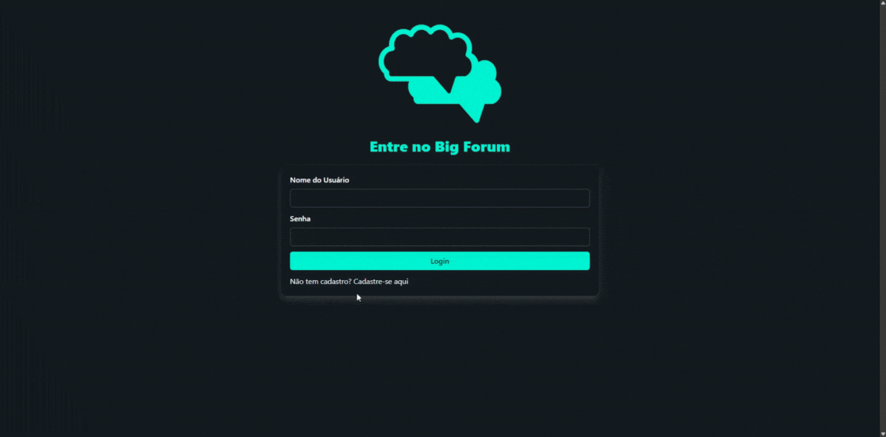

# BIG FORUM


## Sobre o projeto
Este é um projeto de moderação de conteúdo baseado em inteligência artificial, desenvolvido com Flask (Python), que também é responsável por renderizar diretamente as páginas em HTML, CSS e JavaScript.

A aplicação funciona como um sistema moderador em uma interface web simples, capaz de identificar e bloquear automaticamente conteúdos considerados impróprios antes de serem exibidos ou processados.

Com uma estrutura leve e integrada, o projeto serve como base para sistemas que exigem filtragem de mensagens, como chats, seções de comentários ou qualquer tipo de entrada de texto por usuários.

Estamos utilizando a API da OpenAI para integrar a inteligência artificial responsável pela análise e moderação dos conteúdos. Para segurança, o sistema implementa bcrypt no armazenamento e verificação de senhas dos usuários. O controle de login e logout é gerenciado por meio de session (sessão de usuário) do Flask, garantindo uma experiência autenticada. A interface visual é estilizada com o framework Bulma CSS, proporcionando um layout limpo, responsivo e moderno.


## Exemplo da aplicação


## Como utilizar?
#### Clonar Repositório
```bash
git clone https://github.com/vinilima2/bootcamp-ia-moderacao.git
cd bootcamp-ia-moderacao
```

#### Inicializar Venv
```bash
# No Linux
python3 -m venv venv
source venv/bin/activate
```

```bash
# No Windows
python -m venv venv
venv\Scripts\activate
```

#### Instalar dependências
```bash
pip install -r requirements.txt
```

#### Inicializar banco de dados
```bash
python ./database/initialize_db.py
```

#### Executar Projeto
```bash
flask --app main run
```